# 🧠MindWellness - A Personalized Mental Health Assistant

A full-stack web application designed to support users in tracking and understanding their mental health through mood logging, AI-powered insights, and therapist interaction. Built with **React + TypeScript + Tailwind CSS** on the frontend and **Django** (Python) on the backend with **SQLite** for data storage.

## 🚀 Tech Stack

### Frontend:
- React.js
- TypeScript
- Tailwind CSS
- Zustand (State Management)
- GSAP (Animations)

### Backend:
- Django
- SQLite (default DB)
- pandas (for data analysis)
- DeepFace (for emotion detection) *(model present but not integrated yet)*

---

## ✅ Features Implemented

- [x] User and therapist authentication
- [x] Mood logging system
- [x] Emotion detection model (DeepFace) available
- [x] Zustand-based protected routes in frontend
- [x] Clean UI with Tailwind and GSAP animations

---

## 🛠️ In Progress / Planned

- [ ] Integration of AI model for mood analysis
- [ ] Insight generation dashboard
- [ ] Therapist interaction & feedback system
- [ ] Notification and reminder system
- [ ] Database migration to MySQL or MongoDB (planned)

---

## 📷 Screenshots

### 🏠 Home Page
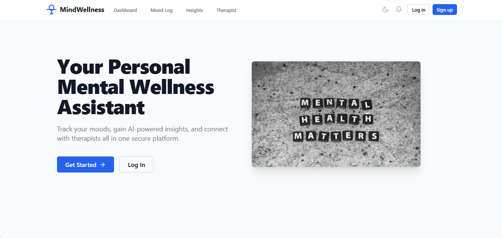

### 🔐 Login Page
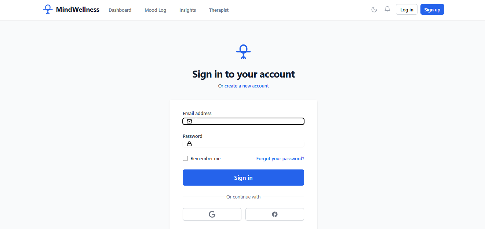

### 📝 Mood Logging Interface
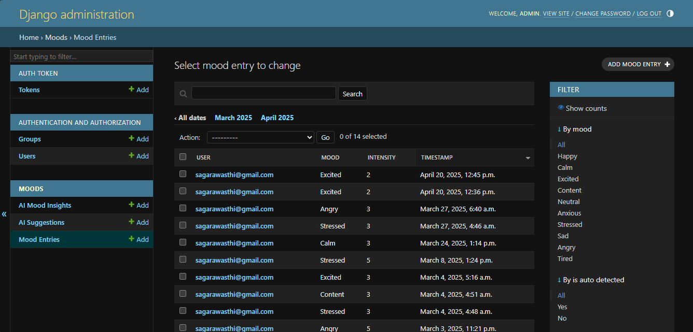

### 🧠 AI Mood Insight (Model Present, Not Integrated)
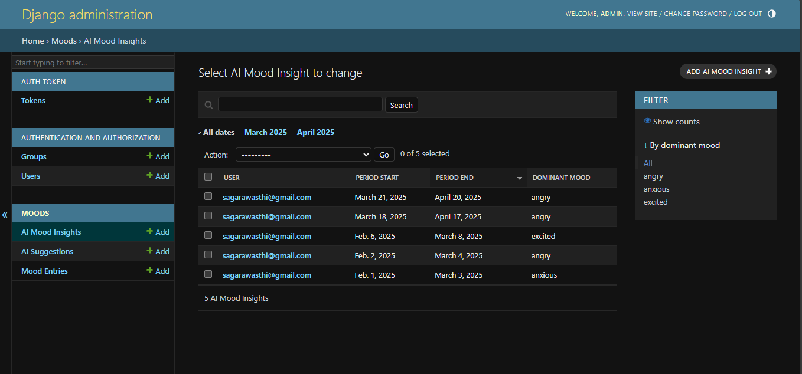

### 📊 AI Insights (Planned)
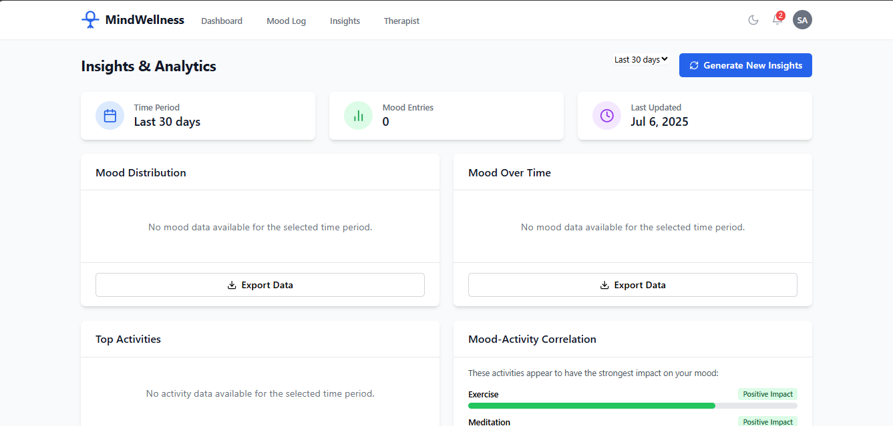

### 📈 Insights Dashboard (UI Only)
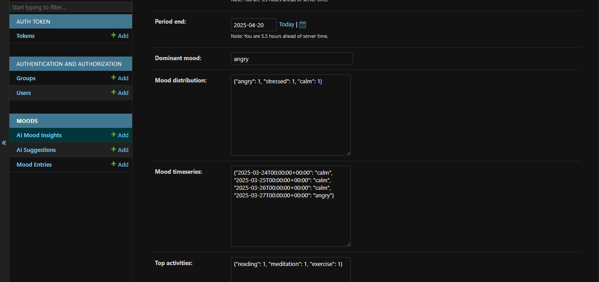

### 🧑‍⚕️ Therapist Panel (Backend Pending)
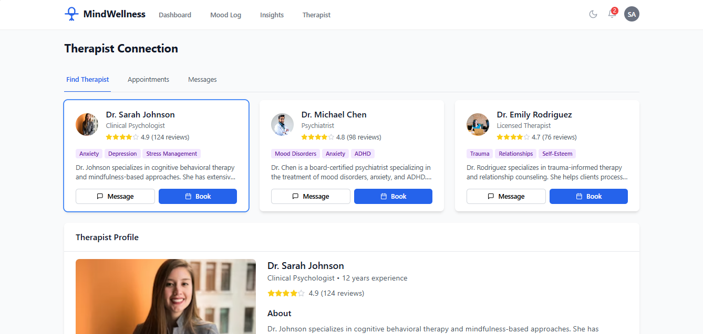

### 👥 Users Dashboard
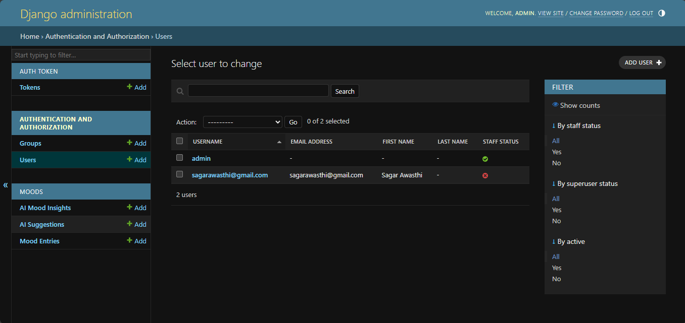

### 🧰 Feature Overview
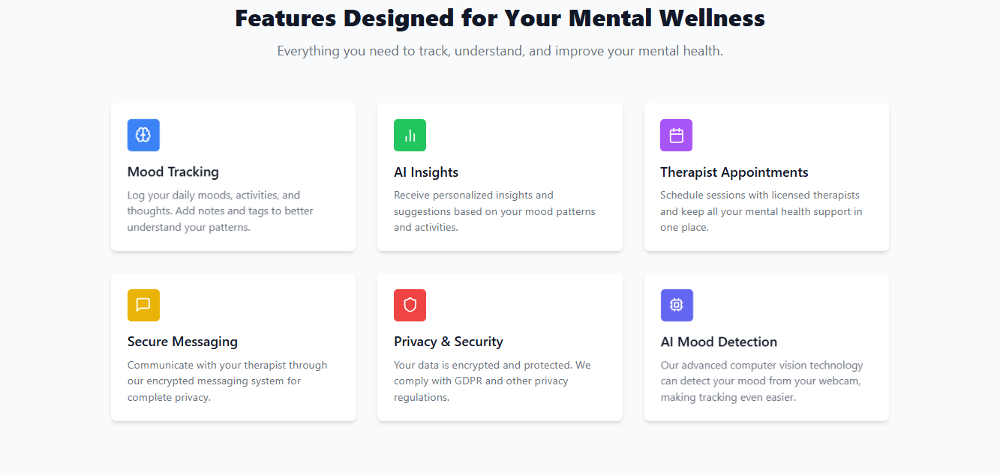

### 🧩 Database Schema (SQLite)
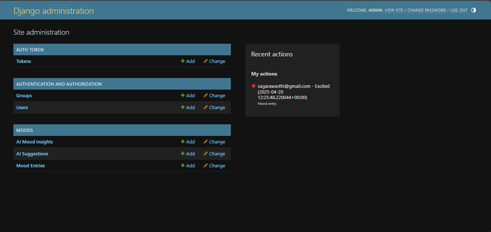

### 🖥️ Main Dashboard
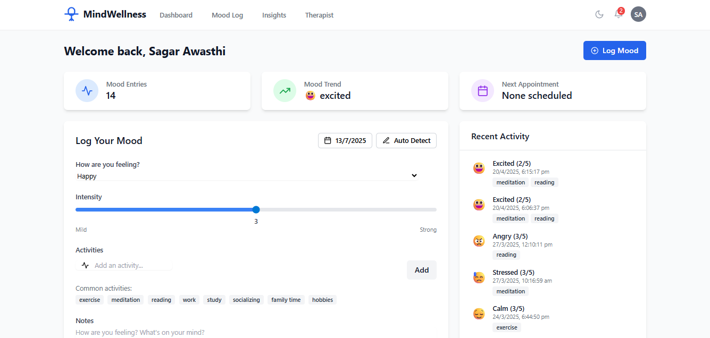

---
